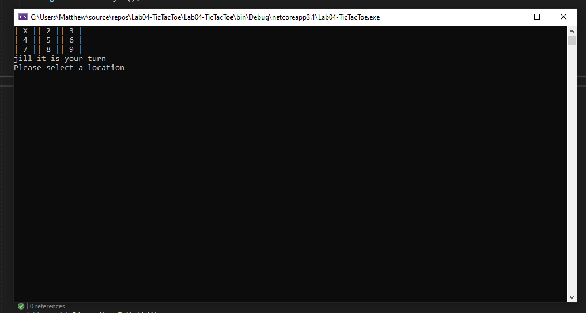
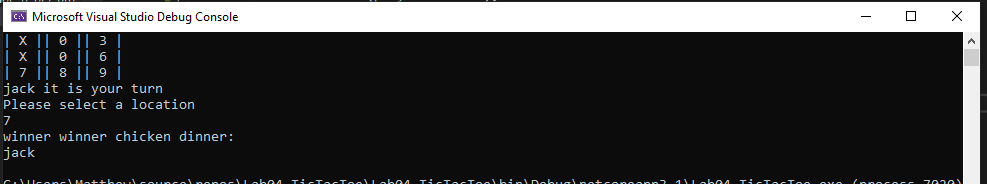

# Lab04-TicTacToe

**Author**: Matthew Petersen, Alan Hung, Jordan Kidwell.

**Version**: 1.0.0 

## Overview
Create a game of Tic-Tac-Toe. 

## Getting Started
To run the program from Visual Studio:
Select File -> Open -> Project/Solution
Next navigate to the location you cloned the Repository.
Double click on the Lab04-TicTacToe directory.
Then select and open Lab04-TicTacToe.sln

## Example

## Architecture
C# + VSC

## Change Log
Use this are to document the iterative changes made to your application as each feature is successfully implemented. Use time stamps. Here's an example:

01-01-2001 4:59pm - Added functionality to add and delete some things. -->
